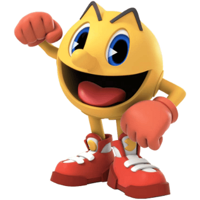
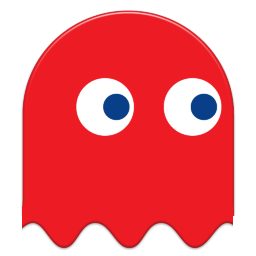
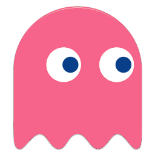

# Pacman

### Introduction

	Ce projet concerne le développement d'une version du jeu PacMan.
	PacMan est commandé par l'utilisateur à travers une interface graphique crée à partir d'une maquette xd. 
	Il doit se déplacer dans une "labyrinthe" en faisant face à des  fantômes,dont les comportements évoluent avec le niveau de jeu.

### Equipe:

 	Gmiden Fatma : gmiden.fatma@gmail.com
 
	De-Oliveira Catia : oliveiracatiafr@gmail.com
	
	Napol Ulrick: ulricknapol@gmail.com
	
Sous l'encadrement de : Mr Vincent Caronnet et Mr Maxime Basset

### Motivation
	L'objectif de notre projet est de réaliser un jeu de labyrinthe de type Pac-Man.
	La réalisation de ce jeu vise à nous familiariser avec le développement responsive au service d'un jeu
	on metrisant les langages html,javaScript, css et PHP et l'architecture MVC.

### Commandes importantes:

    Flèche haut : déplacement en haut 
    Flèche bas : déplacement vers le bas 
    Flèche droite : déplacement vers la droite 
    Flèche gauche : déplacement vers la gauche 
    Enter : Commencer le jeu  
    Espace : Pause/reprendre 
    Deconnexion : revenir au menu principal/afficher les scores
    Utilisation d'une croix multidirectionnelle sur mobile

 ### Prérequis de fonctionnement:
 
    L'utilisateur doit créer un compte pour pouvoir jouer et sauvegarder son score.
    Les scores sont sauvegardés dans la base de donnée
    Au démarrage de jeu et à la fin de chaque étape le tableau de score est affiché.
    Le jeu est constitué de plusieurs niveaux.
    Un fruit apparait dans une position aléatoire disponible (vide et accessible par pac-man) par niveau si le joueur arrive à manger 65 pac-gomme. Ce dernier reste affiché 10 secondes
    Pac-man a trois vies
    des super pac-gommes apparaissent dans les 4 coins de labyrinthe et inversent les rôles pendant 10 secondes
   
### Liste des dossiers et fichiers:

    SQL
    Assets:  
        * Style CSS
        * Java_Script
        * Images
    Controllers:
        *  accountController
        *  ajaxController
        * gameController
        * indexController
    Maquettes
    Models:
        * Score
        * User
    Views:
        * account
        * game
        * index

    * Helpers
    * Index.php
